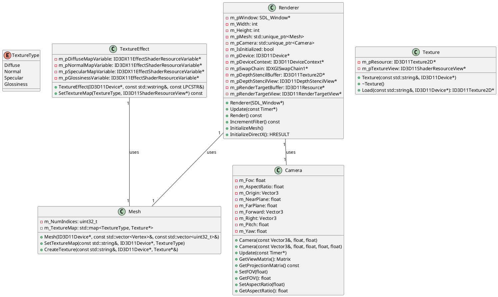

# DX11-Rasterizer

DX11 Rasterizer

```plantuml
@startuml

enum TextureType {
  Diffuse
  Normal
  Specular
  Glossiness
}

class TextureEffect {
  - m_pDiffuseMapVariable: ID3DX11EffectShaderResourceVariable*
  - m_pNormalMapVariable: ID3DX11EffectShaderResourceVariable*
  - m_pSpecularMapVariable: ID3DX11EffectShaderResourceVariable*
  - m_pGlossinessVariable: ID3DX11EffectShaderResourceVariable*
  + TextureEffect(ID3D11Device*, const std::wstring&, const LPCSTR&)
  + SetTextureMap(TextureType, ID3D11ShaderResourceView*) const
}

class Mesh {
  - m_NumIndices: uint32_t
  - m_TextureMap: std::map<TextureType, Texture*>
  + Mesh(ID3D11Device*, const std::vector<Vertex>&, const std::vector<uint32_t>&)
  + SetTextureMap(const std::string&, ID3D11Device*, TextureType)
  + CreateTexture(const std::string&, ID3D11Device*, Texture*&)
}

class Renderer {
  - m_pWindow: SDL_Window*
  - m_Width: int
  - m_Height: int
  - m_pMesh: std::unique_ptr<Mesh>
  - m_pCamera: std::unique_ptr<Camera>
  - m_IsInitialized: bool
  - m_pDevice: ID3D11Device*
  - m_pDeviceContext: ID3D11DeviceContext*
  - m_pSwapChain: IDXGISwapChain1*
  - m_pDepthStencilBuffer: ID3D11Texture2D*
  - m_pDepthStencilView: ID3D11DepthStencilView*
  - m_pRenderTargetBuffer: ID3D11Resource*
  - m_pRenderTargetView: ID3D11RenderTargetView*
  + Renderer(SDL_Window*)
  + Update(const Timer*)
  + Render() const
  + IncrementFilter() const
  + InitializeMesh()
  + InitializeDirectX(): HRESULT
}

class Camera {
  - m_Fov: float
  - m_AspectRatio: float
  - m_Origin: Vector3
  - m_NearPlane: float
  - m_FarPlane: float
  - m_Forward: Vector3
  - m_Right: Vector3
  - m_Pitch: float
  - m_Yaw: float
  + Camera(const Vector3&, float, float)
  + Camera(const Vector3&, float, float, float, float)
  + Update(const Timer*)
  + GetViewMatrix(): Matrix
  + GetProjectionMatrix() const
  + SetFOV(float)
  + GetFOV(): float
  + SetAspectRatio(float)
  + GetAspectRatio(): float
}

class Texture {
  - m_pResource: ID3D11Texture2D*
  - m_pTextureView: ID3D11ShaderResourceView*
  + Texture(const std::string&, ID3D11Device*)
  + ~Texture()
  + Load(const std::string&, ID3D11Device*): ID3D11Texture2D*
}

TextureEffect "1" -- "1" Mesh: uses
Renderer "1" -- "1" Mesh: uses
Renderer "1" -- "1" Camera: uses

@enduml
```
